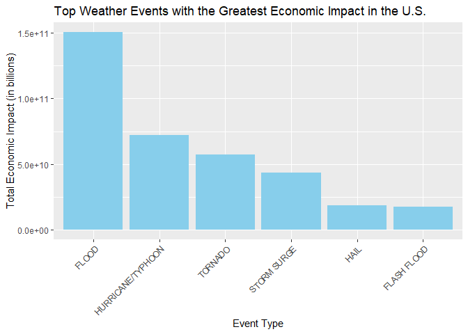

## Synopsis

#### 1. Impact on population health
- Tornadoes are the most impactful in terms of both fatalities and injuries.
- Excessive Heat and Heat also have a significant impact, primarily in terms of fatalities.
- Flash Floods and Lightning also pose considerable health risks.

#### 2. Impact on economy 
- Floods stand out as the most economically impactful type of weather event, followed by Hurricanes/Typhoons.
- Tornadoes, Storm Surges, and Hail also have significant impacts but are considerably less than Floods and Hurricanes.

#### Municipal and government managers can use this information to prioritize resource allocation for disaster preparedness and response strategies.


## Results

#### The types of weather events with the greatest impact on population health, based on the total number of fatalities and injuries:
1. Tornado: Caused 5,633 fatalities and 91,346 injuries.
2. Excessive Heat: Resulted in 1,903 fatalities and 6,525 injuries.
3. Flash Flood: Led to 978 fatalities and 1,777 injuries.
4. Heat: Caused 937 fatalities and 2,100 injuries.
5. Lightning: Responsible for 816 fatalities and 5,230 injuries.

#### Types of weather events with the greatest impact on economy, based on property and crop damages
1. Flood: Total Economic Impact of approximately $150.3 billion.
2. Hurricane/Typhoon: Total Economic Impact of about $71.9 billion.
3. Tornado: Total Economic Impact around $57.4 billion.
4. Storm Surge: Total Economic Impact of approximately $43.3 billion.
5. Hail: Total Economic Impact of about $18.8 billion.


## Data Processing

#### 1. Which types of events are most harmful with respect to population health?

#### Load libraries

```r
# Suppress warnings 
options(warn=-1)

# Load the necessary libraries
suppressPackageStartupMessages({
  library(readr)
  library(dplyr)
  library(tidyr)
  library(ggplot2)
  library(stringr)
})

# Set the warning setting back to default
options(warn=0)
```

#### Load data

```r
# Read the CSV file
csv_file_path <- "repdata_data_StormData.csv"
data <- read_csv(csv_file_path, show_col_types = FALSE)
```

#### Calculate the total fatalities and injuries for each event type and display the top events

```r
# Aggregate the data to calculate the total fatalities and injuries for each event type
health_impact_per_event <- data %>%
  group_by(EVTYPE) %>%
  summarise(FATALITIES = sum(FATALITIES, na.rm = TRUE),
            INJURIES = sum(INJURIES, na.rm = TRUE))

# Sort the results to find the event types with the greatest impact on health
sorted_health_impact <- health_impact_per_event %>%
  arrange(desc(FATALITIES), desc(INJURIES))

# Display the top event types with the highest impact on health
head(sorted_health_impact)
```

```
## # A tibble: 6 × 3
##   EVTYPE         FATALITIES INJURIES
##   <chr>               <dbl>    <dbl>
## 1 TORNADO              5633    91346
## 2 EXCESSIVE HEAT       1903     6525
## 3 FLASH FLOOD           978     1777
## 4 HEAT                  937     2100
## 5 LIGHTNING             816     5230
## 6 TSTM WIND             504     6957
```

#### Create the plots each for fatalities and injuries

```r
# Convert data to long format using pivot_longer
long_data <- pivot_longer(head(sorted_health_impact), 
                          cols = c(FATALITIES, INJURIES), 
                          names_to = "Type", 
                          values_to = "Count")

# Ensure that 'Type' is a factor and has levels in the order we want
long_data$Type <- factor(long_data$Type, levels = c("FATALITIES", "INJURIES"))

# Creating the faceted plot
ggplot(long_data, aes(x = reorder(EVTYPE, -Count), y = Count, fill = Type)) +
  geom_bar(stat = "identity", position = position_dodge()) +
  scale_y_log10() +
  facet_wrap(~ Type, scales = "free_y") +
  labs(title = "Impact of Weather Events on Population Health in the U.S.",
       x = "Event Type",
       y = "Number of People Affected") +
  theme(axis.text.x = element_text(angle = 45, hjust = 1)) +
  scale_fill_manual(values = c("FATALITIES" = "red", "INJURIES" = "orange"))
```

<!-- -->


#### 2. Which types of events have the greatest economic consequences?

#### Convert damage exponent to a numeric multiplier, calculate property and crop damage total, and display the event types with the highest impacts

```r
# Function to convert damage exponent to a numeric multiplier
convert_exp_to_multiplier <- function(exp) {
  exp <- toupper(as.character(exp))
  if (is.na(exp) | exp == "") {
    return(1)
  }
  switch(exp,
         "K" = 1e3,
         "M" = 1e6,
         "B" = 1e9,
         1)  # default case
}

# Apply the conversion function to PROPDMGEXP and CROPDMGEXP
data$PROPDMGEXP_Multiplier <- sapply(data$PROPDMGEXP, convert_exp_to_multiplier)
data$CROPDMGEXP_Multiplier <- sapply(data$CROPDMGEXP, convert_exp_to_multiplier)

# Calculate total property and crop damage in actual values
data$TotalPropertyDamage <- data$PROPDMG * data$PROPDMGEXP_Multiplier
data$TotalCropDamage <- data$CROPDMG * data$CROPDMGEXP_Multiplier

# Aggregate the data to calculate the total economic impact for each event type
total_damage_per_event <- data %>%
  group_by(EVTYPE) %>%
  summarise(TotalPropertyDamage = sum(TotalPropertyDamage, na.rm = TRUE),
            TotalCropDamage = sum(TotalCropDamage, na.rm = TRUE)) %>%
  mutate(TotalEconomicImpact = TotalPropertyDamage + TotalCropDamage) %>%
  arrange(desc(TotalEconomicImpact))

# Display the top event types with the highest economic impacts
head(total_damage_per_event)
```

```
## # A tibble: 6 × 4
##   EVTYPE            TotalPropertyDamage TotalCropDamage TotalEconomicImpact
##   <chr>                           <dbl>           <dbl>               <dbl>
## 1 FLOOD                   144657709807       5661968450       150319678257 
## 2 HURRICANE/TYPHOON        69305840000       2607872800        71913712800 
## 3 TORNADO                  56937160779.       414953270        57352114049.
## 4 STORM SURGE              43323536000             5000        43323541000 
## 5 HAIL                     15732267048.      3025954473        18758221521.
## 6 FLASH FLOOD              16140862067.      1421317100        17562179167.
```

#### Create the plot

```r
# Create bar plot
ggplot(head(total_damage_per_event), aes(x = reorder(EVTYPE, -TotalEconomicImpact), y = TotalEconomicImpact)) +
  geom_bar(stat = "identity", fill = "skyblue") +
  labs(title = "Top Weather Events with the Greatest Economic Impact in the U.S.",
       x = "Event Type",
       y = "Total Economic Impact (in billions)") +
  theme(axis.text.x = element_text(angle = 45, hjust = 1))
```

<!-- -->
